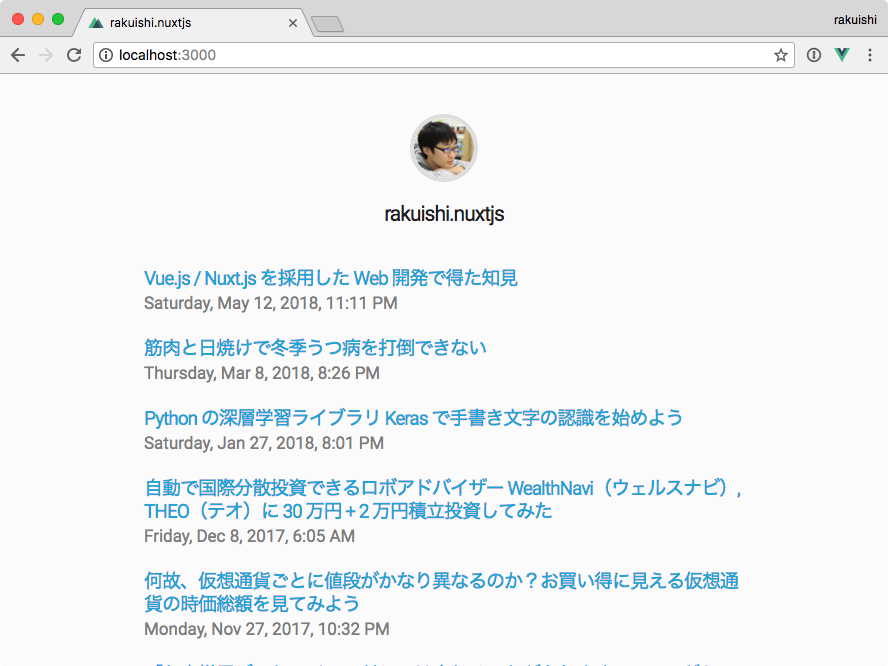

# rakuishi.nuxtjs



> Nuxt.js project

## Build Setup

```bash
$ git clone https://github.com/rakuishi/rakuishi.com.git
$ git clone https://github.com/rakuishi/rakuishi.nuxtjs.git
$ cd rakuishi.nuxtjs
$ npm install
$ ln -s ../rakuishi.com/content content
$ npm run processmd
$ npm run dev
```

## Extensions

* Chrome
  * [Vue.js devtools](https://chrome.google.com/webstore/detail/vuejs-devtools/nhdogjmejiglipccpnnnanhbledajbpd)
* Visual Studio Code
  * ESLint
  * Prettier
  * Vetur

settings.json

```json
{
  "editor.formatOnSave": true,
  "eslint.autoFixOnSave": true,
  "prettier.eslintIntegration": true
}
```
